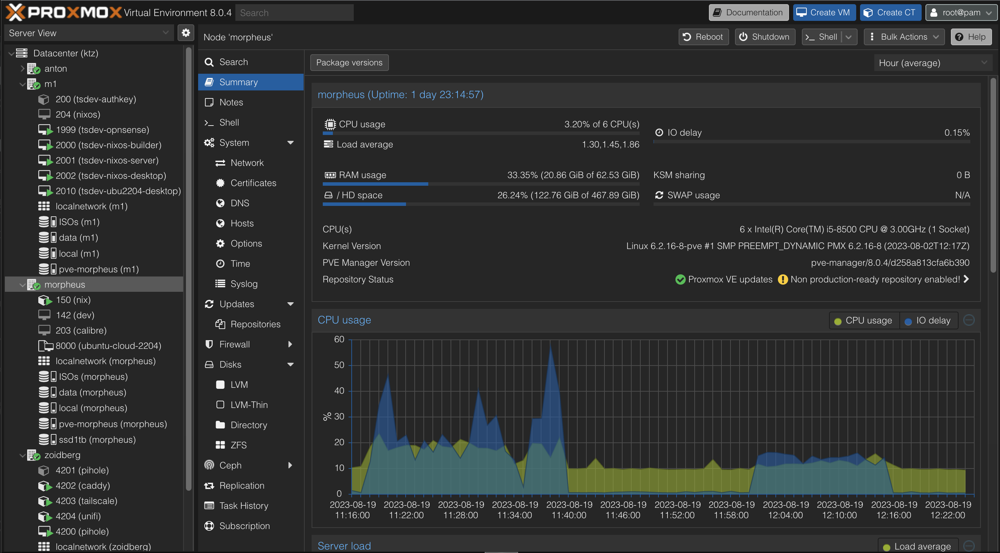

# My-Homelab

This is my repository to record the steps i take to setup my homelab for learning and practicing new technologies.

## Step-1 Proxmox Server
Proxmox Virtual Environment is an open-source server virtualization management platform. It is a Debian-based Linux distribution with a modified Ubuntu LTS kernel which specialises in managing virtual machines and containers.


### Why Proxmox
Proxmox stands out from other hypervisors because it combines both virtual machines (VMs) and containers in one platform, offering flexibility. It's open-source and free to use, with a user-friendly web interface for easy management. It also has powerful features like high availability, backup, and easy clustering, which makes it great for both small and large setups.     
### Installing Proxmox 
In order to install proxmox 1st download latest version of [Proxmox Virtual Enviroment ISO Installer](https://www.proxmox.com/en/downloads/proxmox-virtual-environment/iso).        
You can follow this youtube [video](https://www.youtube.com/watch?v=u8E3-Zy9NvI&list=PLT98CRl2KxKHnlbYhtABg6cF50bYa8Ulo&index=3) to install proxmox on any system.    

## Setting Up Proxmox
### 1st setup bridge network VLAN awairness.    
  Your-Hostname &rarr; Network &rarr; double click on `Linux Bridge` &rarr; check box `Vlan Aware`.
### Setting up storage setting to ulitize all storage (by removing `local-lvm`):
  1. Go to Datecenter &rarr; Storage &rarr; select on `local-lvm` &rarr; press `remove`&rarr; Yes.
  2. Hostname &rarr; Shell &rarr; Enter follwing commands 1 by 1.
     ```bash
     lvremove /dev/pve/data -y
     lvresize -l +100%FREE /dev/pve/root
     resize2fs /dev/mapper/pve-root
     ```
  3. Go to Datecenter &rarr; Storage &rarr; select on `local` &rarr; press `edit` &rarr; Content &rarr; Selelct all options &rarr; press `OK`.
### Downloading Lxc (Linux Containers):      
  `Local(storage)` &rarr; CT Templates &rarr; press on `Templates` &rarr; search `ubuntu-22 or debian12` &rarr; select `ubuntu-22 / debian-12` press `download` (Wait for download to finish`TASK OK` than exit).        
  - Why Lxc over OS:
    Lxc is preferred over a full Linux server OS because it is more lightweight and resource-efficient. Unlike a full OS, Lxc containers share the host’s (Proxmox) kernel, leading to faster performance, quicker start-up times, and lower overhead. This makes Lxc ideal for running multiple isolated applications on the same machine, offering better scalability and portability without the resource demands of a full OS.        
     <br><br><br><br>

[My Homelab Network](#my-homelab-network) 
