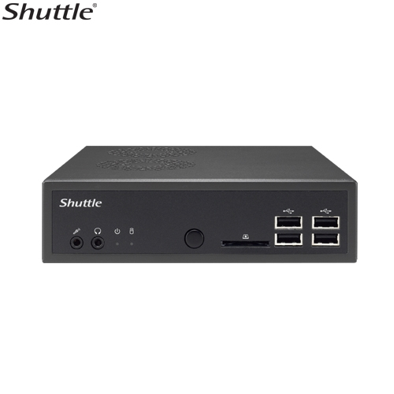

# My-Homelab

  This is my repository to record the steps i take to setup my homelab for learning and practicing new technologies.

## Hardware (Shuttle DS81D)
  I am using the refurbished Shuttle DS81D which i bought from local market (Sadar Karachi) for my homelab because of its compact size, reliability, and solid performance. Equipped with an Intel Core i5 4th Gen (Intel(R) Core(TM) i5-4590T CPU @ 2.00GHz) processor with 16GB of RAM, it offers an ideal balance of power and energy efficiency for running a services like Docker and Kubernetes cluster. Its small form factor allows me to maintain a tidy setup while efficiently managing containerized applications and orchestrating workloads. The robust connectivity options and expandability further enhance its versatility, making it a great choice for hosting various services and experimenting with containerization and microservices in my home network.         
  <p align="center">
    
  </p>
  
  <br>   

## OS (Proxmox VE)
  Proxmox Virtual Environment is an open-source server virtualization management platform. It is a Debian-based Linux distribution with a modified Ubuntu LTS kernel which specialises in managing virtual machines and containers.
  
  
  <br>
  ### Why Proxmox
  Proxmox stands out from other hypervisors because it combines both virtual machines (VMs) and containers in one platform, offering flexibility. It's open-source and free to use, with a user-friendly web interface for easy management. It also has powerful features like high availability, backup, and easy clustering, which makes it great for both small and large setups.     
  ### Installing Proxmox 
  In order to install proxmox download latest version of [Proxmox Virtual Enviroment ISO Installer](https://www.proxmox.com/en/downloads/proxmox-virtual-environment/iso).        
  You can follow this youtube [video](https://www.youtube.com/watch?v=u8E3-Zy9NvI&list=PLT98CRl2KxKHnlbYhtABg6cF50bYa8Ulo&index=3) to install proxmox on any system.    

## After Installaing Proxmox

  Open your main system, other than of proxmox, which will be on Ssame LAN as proxmox server. Open browser and enter `https://<proxmox-server-ip>:8006`, in user enter `root` and in password enter password you set up at time of installing proxmox.
  
  In Proxmox, each individual server is referred to as a `node`. A `Proxmox Cluster` is formed by combining multiple nodes to work together.
  
  ### 1. Enable VLAN Awairness.   
  
  Your-Node &rarr; Network &rarr; double click on `Linux Bridge` &rarr; check box `Vlan Aware`.     
    
  ### 2. Setting up storage setting to ulitize all storage (by removing `local-lvm`):
  1. Go to Datacenter &rarr; Storage &rarr; select on `local-lvm` &rarr; press `remove`&rarr; Yes.
  
  2. Your-node &rarr; Shell &rarr; Enter follwing commands.
  ```bash
  lvremove /dev/pve/data -y
  ```
       
  ```bash
  lvresize -l +100%FREE /dev/pve/root
  ```
       
  ```bash
  resize2fs /dev/mapper/pve-root
  ```
    
  3. Go to Datecenter &rarr; Storage &rarr; select on `local` &rarr; press `edit` &rarr; Content &rarr; Selelct all options &rarr; press `OK`.
                               
---

## Things I Have Learned:

  ### LXC (Linux Conatiner)
  I have used LXC (Ubuntu-22) to practice `Docker`, it works perfectly for basic Docker works like running containers, building images, creating networks, adding volumes & composing ifrastructure but it doesn't work for orchestration like `Docker Swarm` if you are runing Docker swarm or Kubernetes you have to use VM instead of LXC.

  ### VMs
  I have used VM (Ubuntu-Server-24 LTS) for Docker Swarm (orchestration) and also use it as Kubernetes Cluster Node.

  Noted
  
